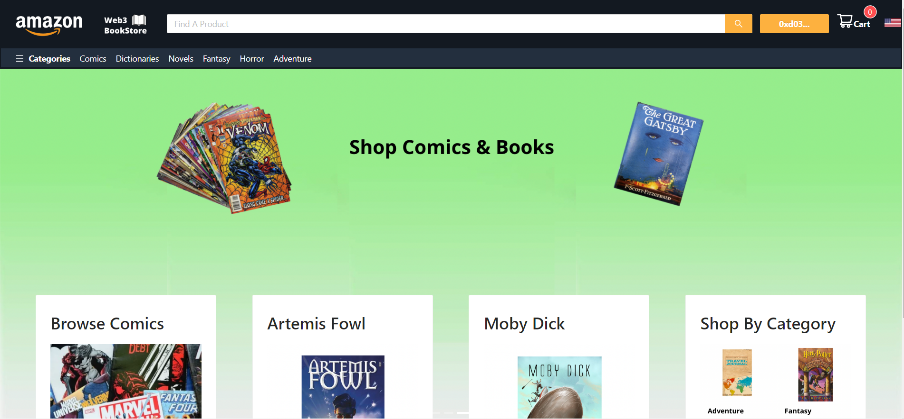

# Amazon3Moralis

## A web 3.0 application built using React, which allows you to connect wallet via metamask and buy books using MATIC coins, built using the Moralis SDK and on the Mumbai testnet.

